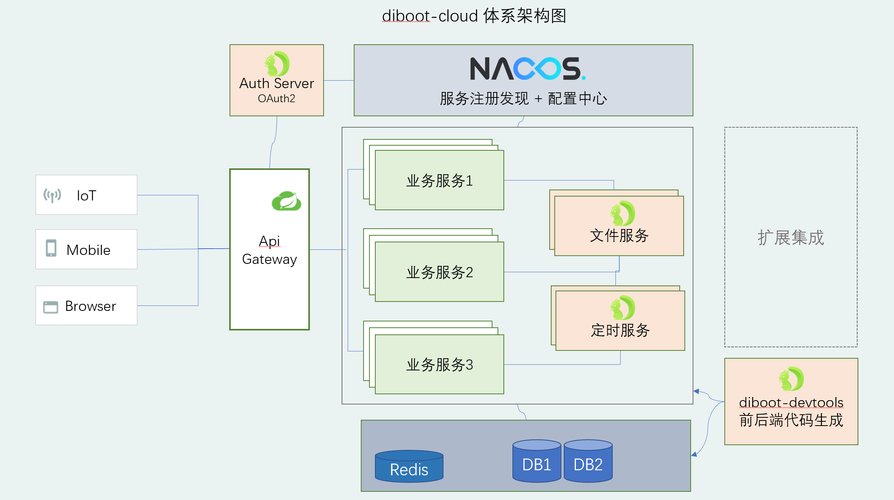

# diboot-cloud
# diboot 低代码开发平台微服务版

    
    

> 设计目标: 为开发人员打造的低代码开发平台，将复杂的工作简单化、重复的工作自动化，提高质量、效率、可维护性。

[diboot基础，spring boot版本，移步这里->](https://github.com/dibo-software/diboot)

## diboot-cloud 核心特性
基于diboot spring boot版本打造，将diboot的优势延申到微服务开发场景：
1. diboot-core 基础组件适配，并基于微服务调整优化，使关联绑定等特性可用于微服务场景
2. diboot-devtools 无缝兼容cloud微服务环境下的生成
3. auth-server认证中心基于Spring Security的标准OAuth2实现
4. 权限体系支持diboot IAM组件的完整功能（组织机构、岗位、人员、角色、权限等基础管理功能）
5. 支持本地及FastDFS分布式文件存储，极简扩展接口支持其他存储形式
6. 支持定时任务服务模块
7. 前端支持antd（diboot-antd-admin）

## diboot-cloud 架构图

## diboot-cloud 模块说明
- **api-gateway**:  接口网关
- **auth-server**:  认证中心
- **business-modules**: 业务模块
    - example-api:  业务模块示例
- **diboot-commons**: diboot通用组件
    - diboot-common-api:    通用接口
    - diboot-common-base:   通用实体类等
    - diboot-common-redis:  通用redis配置
    - diboot-common-excel:  通用excel解析
- **diboot-modules**: diboot预置模块
    - diboot-file:  文件服务模块
    - diboot-scheduler: 定时任务服务模块
- **diboot-antd-admin**: 前端项目(antdv)
 
## diboot-cloud 依赖：
* **spring-boot**: 2.3.8.RELEASE
* **spring-cloud**: Hoxton.SR9
* **spring-cloud-alibaba**: 2.2.4.RELEASE
* **diboot-core**: 2.2.0

[-> 详细文档请查阅官网](https://www.diboot.com/guide/diboot-cloud/introduce.html)

> 使用过程中遇到问题，可加群交流。